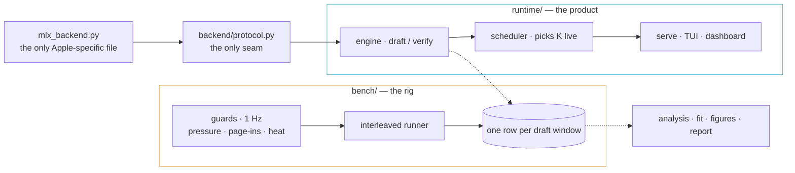

<picture>
  <source media="(prefers-color-scheme: dark)" srcset="./assets/hero-dark.svg?v=1">
  
</picture>

<p>
  <a href="https://github.com/kidus-der/acceptrate/actions/workflows/ci.yml"></a>
  
  
  
  <a href="./LICENSE"></a>
  <a href="./docs/report.md"></a>
</p>

A small model guesses the next few words; the big model checks them all in one pass. Apple's mlx-lm already ships this trick. Nobody had measured **when it actually helps on a normal Mac** — published numbers ran from 2.4× faster to a loss in 24 of 24 configs. This repo is the measurement, the map, and a runtime that uses it.

### The one curve that explains everything

<picture>
  <source media="(prefers-color-scheme: dark)" srcset="./assets/verify-cost-dark.svg?v=1">
  
</picture>

The textbook assumes checking K guesses costs the same as writing one word. On a base M4 it does — for two guesses. Then the cost climbs almost linearly, and every result below follows from it: the published closed form scores **R² = −12.5** against our grid; with this measured cost in its denominator it scores **R² = 0.97**.

<picture>
  <source media="(prefers-color-scheme: dark)" srcset="./assets/curve-dark.svg?v=1">
  
</picture>

| kind of text | best K | speedup | worst cell |
|---|---|---|---|
| code · json | 2 | **1.9×** | 0.92× · 1.03× |
| reasoning | 2 | 1.8× | 0.90× |
| summaries | 4 | 1.7× | 0.70× |
| prose · chat | 2 | 1.6× | **0.66× · 0.58×** |

Losing cells are published, not dropped. The full grid — 3 drafts × K 0…8 × 6 workloads, 90,654 windows with every guard reading — is in [`traces/`](./traces) and every figure regenerates from it with one command.

### Try it

```sh
git clone git@github.com:kidus-der/acceptrate.git && cd acceptrate
uv sync && make test                    # ~500 tests, no model needed
uv run acceptrate models pull           # 8B 4-bit target + 1B 4-bit draft, ~5 GB
uv run acceptrate serve --adaptive      # OpenAI-compatible endpoint + dashboard at http://127.0.0.1:8321
uv run acceptrate chat                  # the live instrument panel (Go), or: make chat-demo — no model
make reproduce                          # every figure and table, from the raw traces
```

Point Open WebUI, Zed or continue.dev at `http://127.0.0.1:8321/v1` and it just works.

### What's inside



The measuring side and the running side never import each other; they meet only at the trace schema, so the benchmark cannot be flattered by the thing it measures. Every timing forces the GPU to finish first (MLX is lazy — [the trap, quantified](./tests/test_laziness.py)). Guards run on their own thread; the hot loop reads an int.

### Honest results, including the ones that hurt

Eight gates, each machine-checked, evidence in [`docs/gates/`](./docs/gates). Seven passed. The adaptive-K gate did not: the scheduler finds K=2 on its own and stays there, because on this chip K=2 is already optimal for every workload — a per-prompt oracle gains 0.0%. That is the finding, and it stays marked failed. Losslessness is exact up to the platform's own fp16 kernel noise, which is calibrated rather than assumed ([P2](./docs/gates/P2.md)).

The map is drawn from one machine on one day; the second-day rerun, a sharper sampling test and the polish on the terminal and browser views are still ahead. The numbers here will move a little — the shape will not.

<p>
  <a href="./docs/report.md">Report</a> · <a href="./docs/gates">Gate evidence</a> · <a href="./docs/findings">Findings</a> · <a href="./traces">Dataset</a> · <a href="./CLAUDE.md">Rules of the repo</a> · <a href="https://claude.ai/artifact/7K2oAJoHdFcENv9FAtxqq3">Design brief</a>
</p>
